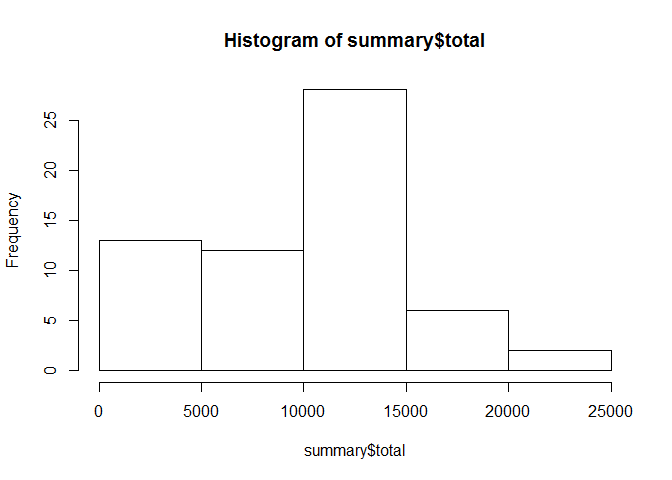
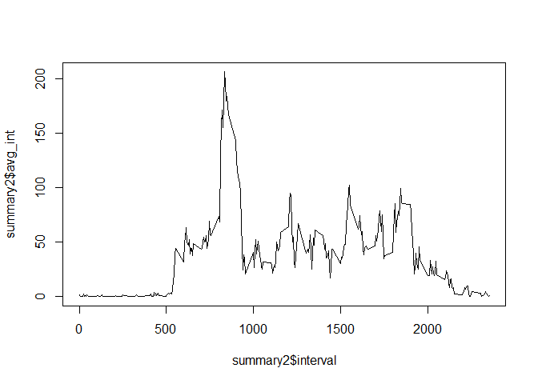
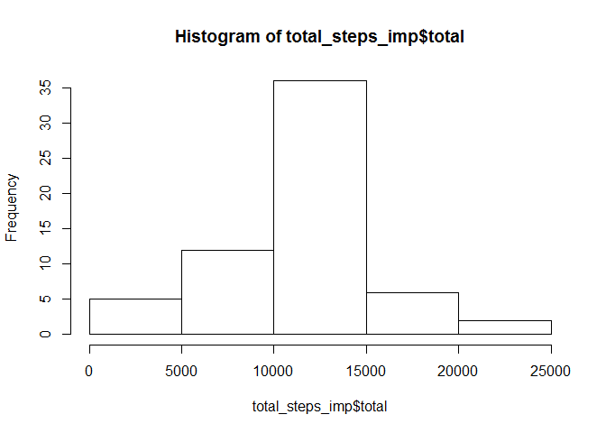
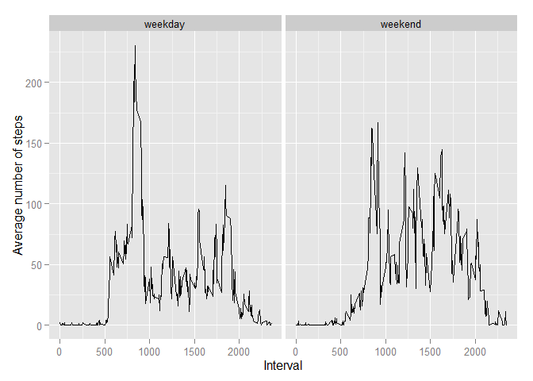
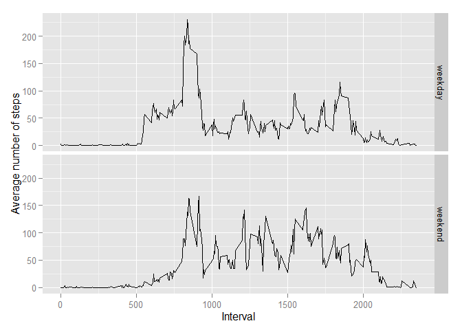

# Reproducible Research: Peer Assessment 1


## Loading and preprocessing the data


```r
setwd("~/GitHub/RepData_PeerAssessment1")    
activity = read.csv("activity.csv", header=T)   
library("dplyr", lib.loc="~/R/win-library/3.1")    
```

```
## 
## Attaching package: 'dplyr'
## 
## The following object is masked from 'package:stats':
## 
##     filter
## 
## The following objects are masked from 'package:base':
## 
##     intersect, setdiff, setequal, union
```

```r
# Create new data set with total number of steps taken per day    
summary = activity %>% group_by(date) %>% summarize(total=sum(steps, na.rm=TRUE))
str(summary)
```

```
## Classes 'tbl_df', 'tbl' and 'data.frame':	61 obs. of  2 variables:
##  $ date : Factor w/ 61 levels "2012-10-01","2012-10-02",..: 1 2 3 4 5 6 7 8 9 10 ...
##  $ total: int  0 126 11352 12116 13294 15420 11015 0 12811 9900 ...
##  - attr(*, "drop")= logi TRUE
```

## What is mean total number of steps taken per day?


```r
# Create histogram for total number of steps taken per day
hist(summary$total)
```

 

####mean total number of steps taken per day


```r
mean(summary$total)
```

```
## [1] 9354.23
```


####median total number of steps taken per day


```r
median(summary$total)
```

```
## [1] 10395
```


## What is the average daily activity pattern?


```r
# Create a new data set with mean steps per interval averaged accross all days
summary2 = activity %>% group_by(interval) %>%
            summarize(avg_int = mean(steps, na.rm=TRUE))
str(summary2)
```

```
## Classes 'tbl_df', 'tbl' and 'data.frame':	288 obs. of  2 variables:
##  $ interval: int  0 5 10 15 20 25 30 35 40 45 ...
##  $ avg_int : num  1.717 0.3396 0.1321 0.1509 0.0755 ...
##  - attr(*, "drop")= logi TRUE
```

```r
plot(summary2$interval,summary2$avg_int, type="l")
```

 

#### Interval with maximum total steps


```r
ind = which(summary2$avg_int==max(summary2$avg_int))
summary2$interval[ind]
```

```
## [1] 835
```


## Imputing missing values
#### Calculate number of missing values


```r
sum(!complete.cases(activity))
```

```
## [1] 2304
```
### Imputing missing values strategy

Missing values for each interval in the original data set will be replaced with the relevant average value for that interval calculated from the original data and stored in data set "summary2".


```r
# Imputing missing values
for (i in 1:length(activity$steps))

        {if (is.na(activity$steps[i])) activity$steps[i] = 
                  summary2[(summary2$interval==activity$interval[i]),2]}
# Convert 'list' to 'vector'        
activity$steps = unlist(activity$steps)

# Create a new dataset with total steps per day from imputed data
total_steps_imp = activity %>% group_by(date) %>% 
                  summarize(total=sum(steps, na.rm=TRUE))

hist(total_steps_imp$total)
```

 

```r
mean(total_steps_imp$total)
```

```
## [1] 10766.19
```

```r
median(total_steps_imp$total)
```

```
## [1] 10766.19
```
### Comment
As expected the mean and median from the inputed data are larger than 

the relevant values from original data with missing values


## Are there differences in activity patterns between weekdays and weekends?

```r
activity$date = as.Date(activity$date)
# Create  character vector 'weekdays' 
activity$weekdays = weekdays( activity$date)
str( activity)
```

```
## 'data.frame':	17568 obs. of  4 variables:
##  $ steps   : num  1.717 0.3396 0.1321 0.1509 0.0755 ...
##  $ date    : Date, format: "2012-10-01" "2012-10-01" ...
##  $ interval: int  0 5 10 15 20 25 30 35 40 45 ...
##  $ weekdays: chr  "Monday" "Monday" "Monday" "Monday" ...
```

```r
# Create logical vector 'weekend'
activity$weekend = as.logical((activity$weekdays=="Saturday")|(activity$weekdays == "Sunday"))
str( activity)
```

```
## 'data.frame':	17568 obs. of  5 variables:
##  $ steps   : num  1.717 0.3396 0.1321 0.1509 0.0755 ...
##  $ date    : Date, format: "2012-10-01" "2012-10-01" ...
##  $ interval: int  0 5 10 15 20 25 30 35 40 45 ...
##  $ weekdays: chr  "Monday" "Monday" "Monday" "Monday" ...
##  $ weekend : logi  FALSE FALSE FALSE FALSE FALSE FALSE ...
```

```r
# Convert logical vector 'weekend' to class 'factor'
activity$weekend = as.factor(activity$weekend)
str( activity)
```

```
## 'data.frame':	17568 obs. of  5 variables:
##  $ steps   : num  1.717 0.3396 0.1321 0.1509 0.0755 ...
##  $ date    : Date, format: "2012-10-01" "2012-10-01" ...
##  $ interval: int  0 5 10 15 20 25 30 35 40 45 ...
##  $ weekdays: chr  "Monday" "Monday" "Monday" "Monday" ...
##  $ weekend : Factor w/ 2 levels "FALSE","TRUE": 1 1 1 1 1 1 1 1 1 1 ...
```

```r
# Assign factor levels' names
levels(activity$weekend) =c("weekday","weekend")

# Create a new data set with data grouped by "weekday" and "weekend"
grouped_int_day = activity %>% group_by(interval,weekend) %>% 
                  summarize(avg_steps=mean(steps))

library("ggplot2", lib.loc="~/R/win-library/3.1")
g = ggplot(grouped_int_day, aes(interval,avg_steps))
g = g + geom_line() +facet_grid(.~weekend)
g = g+xlab("Interval")+ylab("Average number of steps")   ## horizontal grid  
print(g)
```

 

```r
g = g + geom_line() +facet_grid(weekend ~ .)   ## vertical grid
print(g)
```

 

### Activity patterns differences between weekdays and weekends

From the plots above it can be seen that for weekdays there is
a higher maximum for the average number of steps around the
interval '830' while for the rest of the day a higher average 
activity takes place during the weekends. 


